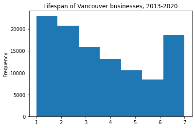

This is the first post in a series on building an end to end machine learning tool using [Vancouver Businesses License data](https://opendata.vancouver.ca/explore/dataset/business-licences) from Vancouver's [Open Data Portal](https://opendata.vancouver.ca/pages/home/). V0 will be a trained model, served up to a website with a simple front end where aspiring Vancouver business owners can plug in some information about their business and get back a success likelihood score[^1] that can help them decide if opening their business is a good idea. 

Data cleaning has been getting some attention lately (e.g. [here](http://veekaybee.github.io/2021/03/26/data-ghosts/), [here](https://twitter.com/beeonaposy/status/1353735905962577920) and [here](https://storage.googleapis.com/pub-tools-public-publication-data/pdf/0d556e45afc54afeb2eb6b51a9bc1827b9961ff4.pdf)), so while cleaning the data sure doesn't sound very sexy, it is a very real and important part of the process as anybody who has worked with real word data can attest. Our model is only as good as our data, so it's vital that we get it nice and shiny. 

One other quick note about this before we bust out the elbow grease. In this case, the exercise became mostly about two things: 1) identifying unique businesses and 2) capturing when businesses shuttered without reporting it to the city. The first is important because if we can't identify businesses, we can't well say much about them. The second is what we're going to build our target from, so it's really the most important bit of information we've got. Other than this, the data starts out pretty clean (consistent formats, not so many missing values, decent documentation, etc.), so let's count our blessings :)

The first thing I will do[^2] is load our data and take a cursory look at what's in it:

```python
import pandas as pd
import numpy as np

df = pd.read_csv('../data/2020.11.15-business-licences.csv', sep=';')
df.info()
```
    <class 'pandas.core.frame.DataFrame'>
    RangeIndex: 509444 entries, 0 to 509443
    Data columns (total 24 columns):
     #   Column                 Non-Null Count   Dtype  
    ---  ------                 --------------   -----  
     0   FOLDERYEAR             509444 non-null  int64  
     1   LicenceRSN             509444 non-null  int64  
     2   LicenceNumber          509444 non-null  object 
     3   LicenceRevisionNumber  509444 non-null  int64  
     4   BusinessName           493514 non-null  object 
     5   BusinessTradeName      207726 non-null  object 
     6   Status                 509444 non-null  object 
     7   IssuedDate             424090 non-null  object 
     8   ExpiredDate            423765 non-null  object 
     9   BusinessType           509444 non-null  object 
     10  BusinessSubType        277373 non-null  object 
     11  Unit                   136789 non-null  object 
     12  UnitType               136748 non-null  object 
     13  House                  286350 non-null  object 
     14  Street                 286363 non-null  object 
     15  City                   508645 non-null  object 
     16  Province               508503 non-null  object 
     17  Country                494312 non-null  object 
     18  PostalCode             282009 non-null  object 
     19  LocalArea              447491 non-null  object 
     20  NumberofEmployees      509444 non-null  float64
     21  FeePaid                429680 non-null  float64
     22  ExtractDate            509444 non-null  object 
     23  Geom                   276450 non-null  object 
    dtypes: float64(2), int64(3), object(19)
    memory usage: 93.3+ MB


So we've got 24 columns and about 500k observations. We have information about when a business licence was issued, its status, when it expired, its location, size and type. Looks fairly promising so far.

## Identify businesses through time

According to the [documentation](https://opendata.vancouver.ca/explore/dataset/business-licences/information/?disjunctive.status&disjunctive.businesssubtype), `LicenceRSN` is the *unique identifier for each business licence generated by the system*. 

I started this project knowing nothing about how the Vancouver Business Licencing process works, so when I first glanced at the data I assumed that businesses retain the same license throughout their existence and simply update the same license on a periodic basis (this must happen yearly in Vancouver). This would be great, because then we could just use `LicenceRSN` to identify our business. 

Unfortunately, each time a business renews their license, they get a brand new `LicenceRSN`. Ideally there would be a `BusinessID` column that would provide a unique identifier for each business. After some email correspondence (Data Science!) with someone on Vancouver's Open Data team, I learned that's not how it works. So, I will have to figure out how to ID businesses myself using the information that's here.

We can use any business information we have that doesn't change over time as an identifying element. If we are generous with our assumptions, that would include all location data, business name and business type. Of course it is entirely possible that all of these things _can_ change (the most common of these would likely be that a business changes location) and it is almost certain that there is at least one instance of each changing somewhere in our data.

In the interest of standing up a complete pipeline as quickly as possible, I'm going to assume that most businesses stay put and do not change their name or type for the duration of their existence. I'm also only going to include businesses located in BC that have registered names. We can revisit these assumptions when we are refining our model at a later stage.

Since there are potentially quite a few identifying columns, I'll start with those that give the name and type of business and slowly expand my set to see how this changes the number of businesses we identify:

```python
# Only want named BC businesses
df = df.loc[df['Province']=='BC']
df = df.loc[df['BusinessName'].notnull()]
# Base set of ID columns
id_cols = ['BusinessName', 'BusinessTradeName', 'BusinessType', 'BusinessSubType']

# Any row with a NaN will be dropped when making id
for col in id_cols + ['House', 'Street', 'City', 'PostalCode', 'LocalArea']:
    df[col] = df[col].replace(np.nan, '')
    df[col] = df[col].replace('NaN', '')

# Generate potential IDs
df['name_id'] = df.groupby(id_cols).ngroup()
df['name_year_id'] = df.groupby(id_cols + ['FOLDERYEAR']).ngroup()
df['name_code_id'] = df.groupby(id_cols + ['PostalCode']).ngroup()
df['name_code_year_id'] = df.groupby(id_cols + ['FOLDERYEAR', 'PostalCode']).ngroup()
df['name_address_id'] = df.groupby(id_cols + ['House', 'Street', 'City', 'PostalCode', 'LocalArea']).ngroup()
df['name_address_year_id'] = df.groupby(id_cols + ['FOLDERYEAR', 'House', 'Street', 'City', 'PostalCode', 'LocalArea']).ngroup()

for var in [
  'name_id', 'name_code_id', 'name_address_id', 'name_year_id', 
  'name_code_year_id', 'name_address_year_id'
  ]:
    print(f'Unique rows, {var}: ', len(df[var].unique()))
```
    Unique rows, name_id:  105776
    Unique rows, name_code_id:  114492
    Unique rows, name_address_id:  161396
    Unique rows, name_year_id:  461196
    Unique rows, name_code_year_id:  477565
    Unique rows, name_address_year_id:  483174

The first three values give us the number of businesses throughout the seven years covered in the data. Rows four to six include the year in the identification, so that's the number of unique business-year combinations. Not surprisingly, when we add the business address to our identification, we get more unique values. The tradeoff here is that without the address we get to keep more data for our analysis, but we incorrectly consider any business that changes their address to be a new business. For now, I am going to choose to go with the id that gives us the most unique values (`name_address_id`). The name only IDs will be useful when we come back to find the business movers.

There are 7,641 licences that are not unique by year (after dropping non-BC and nameless businesses). This is a bit less than 1.5% of the total which doesn't sound too bad. Using name alone would throw out about 6%. We'll be able to recoup some of these, but we will undoubtedly have to throw some out that whose uniqueness can't be distinguished[^3].

To uniquely identify some of those 7,641 businesses, we are going to use the `LicenceRevisionNumber` column. This is a year specific value that is recorded when some aspect of the licence changes (this could perhaps be useful when we come back to our businesses that changed address).

Firstly, let's have a look at our duplicates:

```python
# Rename IDs and drop ones we aren't going to use
df['id'] = df['name_address_id']
df['year_id'] = df['name_address_year_id']
df = df.drop([
  'name_id', 'name_year_id', 'name_code_id', 'name_code_year_id', 
  'name_address_id', 'name_address_year_id'
  ], axis=1)

# Select within year duplicates and have a look
year_duplicates = df.loc[df['year_id'].duplicated(keep=False)]

year_duplicates.sort_values(['id', 'FOLDERYEAR', 'LicenceRevisionNumber'])[:20]
```

I am saving you the output of that last command because it doesn't translate well to a blog post (wayyy too many columns). I will tell you however, that after looking at a number of chunks of this dataframe (i.e. moving those `[:20]` indices around a bit), I can see that we have both licence revisions as well as other cases in there. Let's just look at the licence revisions.

```python
lic_revisions = year_duplicates.loc[~year_duplicates.duplicated(subset=['year_id', 'LicenceRevisionNumber'], keep=False)]

lic_revisions.sort_values(['id', 'FOLDERYEAR', 'LicenceRevisionNumber'])[:10]
```

In the interest of time and actually getting something working, I am going to restrict myself to 1) finding address change cases[^4] and 2) finding licence revisions for uniquely identified companies. I'm sure there will still be duplicates after this. If I want to be super careful, I can compare features (`Status`, `NumberofEmployees`, etc.) of the licences I am throwing out to the licences I am keeping to see if they differ in any substantial way. Let's start with 2).


This looks pretty good! All of these went from an initial status of `Inactive` to `Issued`. My guess is that these are folks who didn't submit their renewal application by the end of the year so their licence lapsed (the [documentation](https://opendata.vancouver.ca/explore/dataset/business-licences/information/?disjunctive.status&disjunctive.businesssubtype) defines `Inactive` as *Licence is no longer active*). As it turns out, close to 90% of these licences take on one of these values. So what do the others look like?


```python
lic_revisions['max_rev'] = lic_revisions.groupby('year_id')['LicenceRevisionNumber'].transform('max')

# lic_revisions.loc[lic_revisions['max_rev']>1].sort_values(['id', 'FOLDERYEAR', 'LicenceRevisionNumber'])[:10]
```

    <ipython-input-12-0536b9767fc4>:1: SettingWithCopyWarning: 
    A value is trying to be set on a copy of a slice from a DataFrame.
    Try using .loc[row_indexer,col_indexer] = value instead
    
    See the caveats in the documentation: https://pandas.pydata.org/pandas-docs/stable/user_guide/indexing.html#returning-a-view-versus-a-copy
      lic_revisions['max_rev'] = lic_revisions.groupby('year_id')['LicenceRevisionNumber'].transform('max')


Hmm. Strange. `LicenceRevisionNumber` doesn't always start with `0` and seems to sometimes skip values. However, it still looks like the highest `LicenceRevisionNumber` is the most recent license status. If I look at all the observations for a particular business it looks like this isn't unusual - lots of transitions from `Inactive` to `Issued`[^5]. What happens if we just take the latest lecence revision for each company?

I also noticed after rereading the documentation of Status and poking around the city's business licence website that a status of `Cancelled` most likely means a cancelled application. I don't think these will be relevant for us, so they will need to be dropped at some point. Also, as far as going out of business goes, the city says this: 

> Please tell us if you close your business. It helps us keep our records up-to-date so we don't send you licence renewal notices in the future.

I seriously doubt that everybody does the city this courtesy, so we will have to look for businesses that drop out of the data from one year to the next.


```python
lic_revisions.loc[lic_revisions['LicenceRevisionNumber']==lic_revisions['max_rev'], 'Status'].value_counts()
```


    Issued                  1199
    Pending                  148
    Cancelled                 95
    Inactive                  37
    Gone Out of Business      17
    Name: Status, dtype: int64


Looks pretty good. I'm going to go ahead and go with this. I will have to figure out what to do with the `Pending` and `Inactive` cases, but that will apply to the rest of the data as well, so I will do that all together. Now to see about the year duplicates that are not because of licence revisions.[^6]

[^7] Full disclosure, after making the `other_duplicates` dataframe below, I had a quick look at the data, grabbing some random chunks of rows just to see what they looked like. That led to the following *Major Discovery*.


```python
lic_revisions_final = lic_revisions.loc[lic_revisions['LicenceRevisionNumber']==lic_revisions['max_rev']]
```


```python
# other_duplicates.shape

# drop_cols = ['LicenceRSN', 'LicenceRevisionNumber', 'BusinessTradeName', 'BusinessSubType', 'Unit', 'UnitType']
# df.loc[df['id'].isin(other_duplicates['id']) & (df['BusinessType']=='One-Family Dwelling')].drop(drop_cols, axis=1).sort_values(['id', 'FOLDERYEAR'])[200:220]
```


```python
other_duplicates = year_duplicates.loc[year_duplicates.duplicated(subset=['year_id', 'LicenceRevisionNumber'], keep=False)]

df1 = pd.concat([other_duplicates['BusinessType'].value_counts(), 
           other_duplicates['BusinessType'].value_counts() / other_duplicates.shape[0]
          ], axis=1)[:10]
df1.columns = ['BusinessCount', 'ShareofTotal']
df1 = df1.join(
    pd.concat([df['BusinessType'].value_counts(), 
               df['BusinessType'].value_counts() / df.shape[0]], 
              axis=1)
)

df1.columns = ['BusinessCount_dup', 'ShareofTotal_dup', 'BusinessCount_full', 'ShareofTotal_full']

df1
```


<div>
<style scoped>
    .dataframe tbody tr th:only-of-type {
        vertical-align: middle;
    }

    .dataframe tbody tr th {
        vertical-align: top;
    }

    .dataframe thead th {
        text-align: right;
    }
</style>
<table border="1" class="dataframe">
  <thead>
    <tr style="text-align: right;">
      <th></th>
      <th>BusinessCount_dup</th>
      <th>ShareofTotal_dup</th>
      <th>BusinessCount_full</th>
      <th>ShareofTotal_full</th>
    </tr>
  </thead>
  <tbody>
    <tr>
      <th>One-Family Dwelling</th>
      <td>3144</td>
      <td>0.324995</td>
      <td>24711</td>
      <td>0.050347</td>
    </tr>
    <tr>
      <th>Apartment House Strata</th>
      <td>938</td>
      <td>0.096961</td>
      <td>13905</td>
      <td>0.028330</td>
    </tr>
    <tr>
      <th>Multiple Dwelling</th>
      <td>859</td>
      <td>0.088795</td>
      <td>8812</td>
      <td>0.017954</td>
    </tr>
    <tr>
      <th>Live-aboards</th>
      <td>726</td>
      <td>0.075047</td>
      <td>730</td>
      <td>0.001487</td>
    </tr>
    <tr>
      <th>Duplex</th>
      <td>582</td>
      <td>0.060161</td>
      <td>7186</td>
      <td>0.014641</td>
    </tr>
    <tr>
      <th>Exhibitions/Shows/Concerts</th>
      <td>466</td>
      <td>0.048170</td>
      <td>1164</td>
      <td>0.002372</td>
    </tr>
    <tr>
      <th>Temp Liquor Licence Amendment</th>
      <td>438</td>
      <td>0.045276</td>
      <td>1146</td>
      <td>0.002335</td>
    </tr>
    <tr>
      <th>Secondary Suite - Permanent</th>
      <td>298</td>
      <td>0.030804</td>
      <td>17495</td>
      <td>0.035645</td>
    </tr>
    <tr>
      <th>Contractor</th>
      <td>204</td>
      <td>0.021087</td>
      <td>30662</td>
      <td>0.062472</td>
    </tr>
    <tr>
      <th>Office</th>
      <td>181</td>
      <td>0.018710</td>
      <td>80090</td>
      <td>0.163178</td>
    </tr>
  </tbody>
</table>
</div>


Owning a rental property is overrepresented in the duplicated data (about 12% of the total), especially a one-family dwelling. This makes sense as pretty much all of these do not have any location information, presumably due to privacy concerns:

> BusinessType
>
> Description of the business activity, usually in accordance with the definition in the Licence By-Law No. 4450. Note: Business type names that have a notation of *Historic* at the end signify retired business licence types. These are business licence types that were once active but have since been retired. **Due to privacy concern, some business types do not have address data.**

So any person (business) who owns and rents out more than one property in the same year will be duplicated. I wasn't able to find confirmation that a licence is required for *every* rental property[^8], but based on what I can see here it seems likely. A quick email to the City would probably be able to confirm.

[^9] After five minutes of searching :D... 80-20 rule, etc...

Now we have a choice. Are these duplicates important to save? Can we just throw them out? Whatever we decide to do, it's important to think about the implications of the decision from both a technical and business perspective. How does our decision impact our data and further downstream, our modeling? What are our business goals and how does our decision impact these?

To help guide the decision, I would think about what our ultimate goal (who our ultimate end user) is. In this case, I would like to have a simple tool that someone who is thinking of starting a business can use to give them some idea of how previous businesses with similar characteristics fared. How likely is it, given some basic characteristics, that my taqueria in Yaletown will survive?

If I am someone who already a number of rental properties, I already probably have a pretty good idea of the market. It's unlikely that my lowly machine learning model is going to add a tremendous amount of value. As the data scientist building this model, I also care more about providing insight to folks who have the least amount of information to begin with. That's a personal preference (or a business decision if I were doing this for an employer or a client) rather than a technical decision.

From a technical perspective, we are likely introducing some bias. If we throw out the duplicates we will almost certainly be introducing some bias into our model: it's unlikely that the survival rate of a one property rental company (the ones we will be saving) will be the same as that of a multiple property rental company (who we will be throwing out). 

For the sake of time (and actually getting to the model-building part of this project), I am going to throw out the duplicates. If we need to, we can always come back and revisit these samples. It will be more important to try and identify the companies that have gone out of business and *not* notified the City. This is what I will turn my attention to now.


```python
# drop the initial subset of data and add back in the licencse revisions

df = df.loc[~df['year_id'].isin(year_duplicates['year_id'])]
df = df.append(lic_revisions_final.drop('max_rev', axis=1), verify_integrity=True)

```


```python
df.columns
```


    Index(['FOLDERYEAR', 'LicenceRSN', 'LicenceNumber', 'LicenceRevisionNumber',
           'BusinessName', 'BusinessTradeName', 'Status', 'IssuedDate',
           'ExpiredDate', 'BusinessType', 'BusinessSubType', 'Unit', 'UnitType',
           'House', 'Street', 'City', 'Province', 'Country', 'PostalCode',
           'LocalArea', 'NumberofEmployees', 'FeePaid', 'ExtractDate', 'Geom',
           'id', 'year_id'],
          dtype='object')


### Cleanup `Status` and calculate lifespan of business


```python
# drop businesses that don't appear in more than one year
df['max_year'] = df.groupby('id')['FOLDERYEAR'].transform('max')
df['min_year'] = df.groupby('id')['FOLDERYEAR'].transform('min')
df['years_active'] = df['FOLDERYEAR'] - df['min_year']
df['lifespan'] = df['max_year'] - df['min_year']
# drops all businesses without records before 2020
df = df.loc[df['lifespan']!=0]
```

It's worth noting here that I am dropping all businesses established in the latest year. Since we are building a model to predict business survival, these aren't very useful to us as they haven't been around long enough to tell us anything[^10]. At some point we will have to define what it means to survive, but for now I will just keep track of how long a business has been around and worry about what survival means during analysis.

I had originally planned on also dropping businesses that never took on an `Issued` status. I had a look at them (see commented code below) and most of them show a value of `Pending` for one or more years before switching to `Gone Out of Business`. It's hard to know exactly what is going on with these. It could be an error or it could be that these businesses never finished their application, paid their fees, or didn't get their application approved for some other reason. Either way, it seems they were mostly operating so I think I will keep them in the data and assume they were operating until the final year they appear.

Now let's ID the businesses that went out of business but never notified the city.


```python
'''
never_issued = df.groupby('id')['Status'].apply(lambda x: 'Issued' not in x.unique())

# never_issued.name = 'never_issued'
never_issued = never_issued[never_issued==True].index

df.loc[
    (df['id'].isin(never_issued)), 
    disp_cols+['IssuedDate']
].sort_values(['id', 'FOLDERYEAR'])[200:250]
'''
```


    "\nnever_issued = df.groupby('id')['Status'].apply(lambda x: 'Issued' not in x.unique())\n\n# never_issued.name = 'never_issued'\nnever_issued = never_issued[never_issued==True].index\n\ndf.loc[\n    (df['id'].isin(never_issued)), \n    disp_cols+['IssuedDate']\n].sort_values(['id', 'FOLDERYEAR'])[200:250]\n"


```python
# businesses that drop out of data without ever recording a value of Gone Out of Business
df['new_status'] = df['Status']

c = ((df['max_year']==df['FOLDERYEAR']) & (df['FOLDERYEAR']!=20))
df.loc[c, 'new_status'] = 'GOB'

df.groupby('FOLDERYEAR')['new_status'].value_counts().unstack(level=0)
```


<div>
<style scoped>
    .dataframe tbody tr th:only-of-type {
        vertical-align: middle;
    }

    .dataframe tbody tr th {
        vertical-align: top;
    }

    .dataframe thead th {
        text-align: right;
</style>
<table border="1" class="dataframe">
  <thead>
    <tr style="text-align: right;">
      <th>FOLDERYEAR</th>
      <th>13</th>
      <th>14</th>
      <th>15</th>
      <th>16</th>
      <th>17</th>
      <th>18</th>
      <th>19</th>
      <th>20</th>
    </tr>
    <tr>
      <th>new_status</th>
      <th></th>
      <th></th>
      <th></th>
      <th></th>
      <th></th>
      <th></th>
      <th></th>
      <th></th>
    </tr>
  </thead>
  <tbody>
    <tr>
      <th>Cancelled</th>
      <td>119.0</td>
      <td>66.0</td>
      <td>107.0</td>
      <td>102.0</td>
      <td>90.0</td>
      <td>91.0</td>
      <td>51.0</td>
      <td>2359.0</td>
    </tr>
    <tr>
      <th>GOB</th>
      <td>NaN</td>
      <td>5515.0</td>
      <td>8198.0</td>
      <td>10278.0</td>
      <td>9567.0</td>
      <td>11756.0</td>
      <td>14659.0</td>
      <td>NaN</td>
    </tr>
    <tr>
      <th>Gone Out of Business</th>
      <td>173.0</td>
      <td>206.0</td>
      <td>206.0</td>
      <td>256.0</td>
      <td>75.0</td>
      <td>88.0</td>
      <td>220.0</td>
      <td>3080.0</td>
    </tr>
    <tr>
      <th>Inactive</th>
      <td>63.0</td>
      <td>79.0</td>
      <td>98.0</td>
      <td>96.0</td>
      <td>121.0</td>
      <td>76.0</td>
      <td>77.0</td>
      <td>859.0</td>
    </tr>
    <tr>
      <th>Issued</th>
      <td>44120.0</td>
      <td>42106.0</td>
      <td>42872.0</td>
      <td>43102.0</td>
      <td>41895.0</td>
      <td>38825.0</td>
      <td>36265.0</td>
      <td>40412.0</td>
    </tr>
    <tr>
    }
      <th>Pending</th>
      <td>3099.0</td>
      <td>4345.0</td>
      <td>4320.0</td>
      <td>2616.0</td>
      <td>3604.0</td>
      <td>4604.0</td>
      <td>4582.0</td>
      <td>4678.0</td>
    </tr>
  </tbody>
</table>
</div>


Not surprisingly, most businesses that don't survive don't bother letting the city know. Now there shouldn't be any `Gone Out of Business` values left in the data, but there clearly are. Let's see if we can figure out why.


```python
anomalies = df.loc[(df['new_status']=='Gone Out of Business') & (df['FOLDERYEAR']!=20), 'id'].unique()

disp_cols = ['FOLDERYEAR', 'BusinessName', 'BusinessType', 'Status', 'id', 'year_id', 'max_year', 'min_year']

anomalies = df.loc[df['id'].isin(anomalies), disp_cols].sort_values(['id', 'FOLDERYEAR'])

anomalies[40:60]

# anomalies.groupby('BusinessType')['id'].nunique().sort_values(ascending=False)

```


<div>
<style scoped>
    .dataframe tbody tr th:only-of-type {
        vertical-align: middle;
    }

    .dataframe tbody tr th {
        vertical-align: top;
    }

    .dataframe thead th {
        text-align: right;
    }
</style>
<table border="1" class="dataframe">
  <thead>
    <tr style="text-align: right;">
      <th></th>
      <th>FOLDERYEAR</th>
      <th>BusinessName</th>
      <th>BusinessType</th>
      <th>Status</th>
      <th>id</th>
      <th>year_id</th>
      <th>max_year</th>
      <th>min_year</th>
    </tr>
  </thead>
  <tbody>
    <tr>
      <th>96963</th>
      <td>15</td>
      <td>(Allison Dube)</td>
      <td>Apartment House Strata</td>
      <td>Issued</td>
      <td>684</td>
      <td>2189</td>
      <td>20</td>
      <td>14</td>
    </tr>
    <tr>
      <th>277245</th>
      <td>16</td>
      <td>(Allison Dube)</td>
      <td>Apartment House Strata</td>
      <td>Issued</td>
      <td>684</td>
      <td>2191</td>
      <td>20</td>
      <td>14</td>
    </tr>
    <tr>
      <th>305151</th>
      <td>18</td>
      <td>(Allison Dube)</td>
      <td>Apartment House Strata</td>
      <td>Gone Out of Business</td>
      <td>684</td>
      <td>2194</td>
      <td>20</td>
      <td>14</td>
    </tr>
    <tr>
      <th>482375</th>
      <td>19</td>
      <td>(Allison Dube)</td>
      <td>Apartment House Strata</td>
      <td>Issued</td>
      <td>684</td>
      <td>2195</td>
      <td>20</td>
      <td>14</td>
    </tr>
    <tr>
      <th>488725</th>
      <td>20</td>
      <td>(Allison Dube)</td>
      <td>Apartment House Strata</td>
      <td>Issued</td>
      <td>684</td>
      <td>2196</td>
      <td>20</td>
      <td>14</td>
    </tr>
    <tr>
      <th>195675</th>
      <td>14</td>
      <td>(Aman Webeshet)</td>
      <td>Auto Detailing</td>
      <td>Issued</td>
      <td>731</td>
      <td>2356</td>
      <td>17</td>
      <td>14</td>
    </tr>
    <tr>
      <th>71312</th>
      <td>15</td>
      <td>(Aman Webeshet)</td>
      <td>Auto Detailing</td>
      <td>Issued</td>
      <td>731</td>
      <td>2357</td>
      <td>17</td>
      <td>14</td>
    </tr>
    <tr>
      <th>210952</th>
      <td>16</td>
      <td>(Aman Webeshet)</td>
      <td>Auto Detailing</td>
      <td>Gone Out of Business</td>
      <td>731</td>
      <td>2358</td>
      <td>17</td>
      <td>14</td>
    </tr>
    <tr>
      <th>303568</th>
      <td>17</td>
      <td>(Aman Webeshet)</td>
      <td>Auto Detailing</td>
      <td>Gone Out of Business</td>
      <td>731</td>
      <td>2359</td>
      <td>17</td>
      <td>14</td>
    </tr>
    <tr>
      <th>297951</th>
      <td>13</td>
      <td>(Anastasia Pantazis)</td>
      <td>Duplex</td>
      <td>Issued</td>
      <td>918</td>
      <td>2889</td>
      <td>17</td>
      <td>13</td>
    </tr>
    <tr>
      <th>199588</th>
      <td>14</td>
      <td>(Anastasia Pantazis)</td>
      <td>Duplex</td>
      <td>Issued</td>
      <td>918</td>
      <td>2890</td>
      <td>17</td>
      <td>13</td>
    </tr>
    <tr>
      <th>178852</th>
      <td>15</td>
      <td>(Anastasia Pantazis)</td>
      <td>Duplex</td>
      <td>Issued</td>
      <td>918</td>
      <td>2891</td>
      <td>17</td>
      <td>13</td>
    </tr>
    <tr>
      <th>208050</th>
      <td>16</td>
      <td>(Anastasia Pantazis)</td>
      <td>Duplex</td>
      <td>Gone Out of Business</td>
      <td>918</td>
      <td>2892</td>
      <td>17</td>
      <td>13</td>
    </tr>
    <tr>
      <th>166794</th>
      <td>17</td>
      <td>(Anastasia Pantazis)</td>
      <td>Duplex</td>
      <td>Gone Out of Business</td>
      <td>918</td>
      <td>2893</td>
      <td>17</td>
      <td>13</td>
    </tr>
    <tr>
      <th>101853</th>
      <td>13</td>
      <td>(Andreas Michantas)</td>
      <td>Contractor</td>
      <td>Issued</td>
      <td>996</td>
      <td>3094</td>
      <td>20</td>
      <td>13</td>
    </tr>
    <tr>
      <th>198632</th>
      <td>14</td>
      <td>(Andreas Michantas)</td>
      <td>Contractor</td>
      <td>Gone Out of Business</td>
      <td>996</td>
      <td>3095</td>
      <td>20</td>
      <td>13</td>
    </tr>
    <tr>
      <th>40750</th>
      <td>17</td>
      <td>(Andreas Michantas)</td>
      <td>Contractor</td>
      <td>Issued</td>
      <td>996</td>
      <td>3096</td>
      <td>20</td>
      <td>13</td>
    </tr>
    <tr>
      <th>387317</th>
      <td>18</td>
      <td>(Andreas Michantas)</td>
      <td>Contractor</td>
      <td>Issued</td>
      <td>996</td>
      <td>3097</td>
      <td>20</td>
      <td>13</td>
    </tr>
    <tr>
      <th>379809</th>
      <td>19</td>
      <td>(Andreas Michantas)</td>
      <td>Contractor</td>
      <td>Issued</td>
      <td>996</td>
      <td>3098</td>
      <td>20</td>
      <td>13</td>
    </tr>
    <tr>
      <th>495162</th>
      <td>20</td>
      <td>(Andreas Michantas)</td>
      <td>Contractor</td>
      <td>Pending</td>
      <td>996</td>
      <td>3099</td>
      <td>20</td>
      <td>13</td>
    </tr>
  </tbody>
</table>
</div>


This is strange. It looks like a lot of these have gone in and out of business more than once under the same name. Most of them are contractors or other businesses that are likely owned and operated by a single person. I'm not really sure what I can do with these, so I will leave them out for now. There are about 1200 businesses and 5500 rows that will be dropped. The rest of these all appear in more than one year. I am going to count anything that is in the data without a `Gone Out of Business` status as operational. 


```python
anomalies.loc[df['FOLDERYEAR']==df['max_year'], 'BusinessType'].value_counts()[:10]
```


    Contractor                        204
    Office                            104
    Electrical Contractor              87
    Retail Dealer                      85
    Restaurant Class 1                 58
    Ltd Service Food Establishment     57
    Contractor - Special Trades        49
    One-Family Dwelling                31
    Health Services                    28
    Secondary Suite - Permanent        28
    Name: BusinessType, dtype: int64


```python
df = df.loc[~df['id'].isin(anomalies['id'])]
```

Since I didn't reclassify the status of any businesses in 2020, we still need to do some cleanup there as well. Let's see what statuses we have. 


```python
df.loc[df['FOLDERYEAR']==20, 'new_status'].value_counts()
```


    Issued                  40159
    Pending                  4595
    Gone Out of Business     3036
    Cancelled                2143
    Inactive                  851
    Name: new_status, dtype: int64


`Issued` and `Gone Out of Business` are pretty straight forward. `Pending` I will go ahead and give them the benefit of the doubt and say they are still in business (remember these are all businesses that were established before 2020, so it's possible their paperwork just hasn't gone through). So what do we do with the `Cancelled` and `Inactive` ones? Well let's have a look at these.


```python
df.loc[
    df['id'].isin(df.loc[(df['FOLDERYEAR']==20) & (df['Status']=='Inactive'), 'id']),
    disp_cols
].sort_values(['id', 'FOLDERYEAR'])[200:220]
```


<div>
<style scoped>
    .dataframe tbody tr th:only-of-type {
        vertical-align: middle;
    }

    .dataframe tbody tr th {
        vertical-align: top;
    }

    .dataframe thead th {
        text-align: right;
    }
</style>
<table border="1" class="dataframe">
  <thead>
    <tr style="text-align: right;">
      <th></th>
      <th>FOLDERYEAR</th>
      <th>BusinessName</th>
      <th>BusinessType</th>
      <th>Status</th>
      <th>id</th>
      <th>year_id</th>
      <th>max_year</th>
      <th>min_year</th>
    </tr>
  </thead>
  <tbody>
    <tr>
      <th>333275</th>
      <td>19</td>
      <td>(Martin Staffolani)</td>
      <td>Referral Services</td>
      <td>Issued</td>
      <td>13572</td>
      <td>44306</td>
      <td>20</td>
      <td>19</td>
    </tr>
    <tr>
      <th>472976</th>
      <td>20</td>
      <td>(Martin Staffolani)</td>
      <td>Referral Services</td>
      <td>Inactive</td>
      <td>13572</td>
      <td>44307</td>
      <td>20</td>
      <td>19</td>
    </tr>
    <tr>
      <th>183710</th>
      <td>15</td>
      <td>(Martin Voslar)</td>
      <td>Instruction</td>
      <td>Issued</td>
      <td>13576</td>
      <td>44327</td>
      <td>20</td>
      <td>15</td>
    </tr>
    <tr>
      <th>83885</th>
      <td>16</td>
      <td>(Martin Voslar)</td>
      <td>Instruction</td>
      <td>Issued</td>
      <td>13576</td>
      <td>44328</td>
      <td>20</td>
      <td>15</td>
    </tr>
    <tr>
      <th>100447</th>
      <td>17</td>
      <td>(Martin Voslar)</td>
      <td>Instruction</td>
      <td>Issued</td>
      <td>13576</td>
      <td>44329</td>
      <td>20</td>
      <td>15</td>
    </tr>
    <tr>
      <th>341616</th>
      <td>18</td>
      <td>(Martin Voslar)</td>
      <td>Instruction</td>
      <td>Issued</td>
      <td>13576</td>
      <td>44330</td>
      <td>20</td>
      <td>15</td>
    </tr>
    <tr>
      <th>321646</th>
      <td>19</td>
      <td>(Martin Voslar)</td>
      <td>Instruction</td>
      <td>Issued</td>
      <td>13576</td>
      <td>44331</td>
      <td>20</td>
      <td>15</td>
    </tr>
    <tr>
      <th>496557</th>
      <td>20</td>
      <td>(Martin Voslar)</td>
      <td>Instruction</td>
      <td>Inactive</td>
      <td>13576</td>
      <td>44332</td>
      <td>20</td>
      <td>15</td>
    </tr>
    <tr>
      <th>126259</th>
      <td>17</td>
      <td>(Maryam Zagar)</td>
      <td>Office</td>
      <td>Issued</td>
      <td>13642</td>
      <td>44557</td>
      <td>20</td>
      <td>17</td>
    </tr>
    <tr>
      <th>421833</th>
      <td>18</td>
      <td>(Maryam Zagar)</td>
      <td>Office</td>
      <td>Issued</td>
      <td>13642</td>
      <td>44558</td>
      <td>20</td>
      <td>17</td>
    </tr>
    <tr>
      <th>398928</th>
      <td>19</td>
      <td>(Maryam Zagar)</td>
      <td>Office</td>
      <td>Issued</td>
      <td>13642</td>
      <td>44559</td>
      <td>20</td>
      <td>17</td>
    </tr>
    <tr>
      <th>489425</th>
      <td>20</td>
      <td>(Maryam Zagar)</td>
      <td>Office</td>
      <td>Inactive</td>
      <td>13642</td>
      <td>44560</td>
      <td>20</td>
      <td>17</td>
    </tr>
    <tr>
      <th>53081</th>
      <td>13</td>
      <td>(Matthew Cooperwilliams)</td>
      <td>Office</td>
      <td>Issued</td>
      <td>13726</td>
      <td>44803</td>
      <td>20</td>
      <td>13</td>
    </tr>
    <tr>
      <th>185212</th>
      <td>14</td>
      <td>(Matthew Cooperwilliams)</td>
      <td>Office</td>
      <td>Issued</td>
      <td>13726</td>
      <td>44804</td>
      <td>20</td>
      <td>13</td>
    </tr>
    <tr>
      <th>58627</th>
      <td>15</td>
      <td>(Matthew Cooperwilliams)</td>
      <td>Office</td>
      <td>Issued</td>
      <td>13726</td>
      <td>44805</td>
      <td>20</td>
      <td>13</td>
    </tr>
    <tr>
      <th>282931</th>
      <td>16</td>
      <td>(Matthew Cooperwilliams)</td>
      <td>Office</td>
      <td>Issued</td>
      <td>13726</td>
      <td>44806</td>
      <td>20</td>
      <td>13</td>
    </tr>
    <tr>
      <th>467997</th>
      <td>20</td>
      <td>(Matthew Cooperwilliams)</td>
      <td>Office</td>
      <td>Inactive</td>
      <td>13726</td>
      <td>44810</td>
      <td>20</td>
      <td>13</td>
    </tr>
    <tr>
      <th>322945</th>
      <td>19</td>
      <td>(Melanie Gatzke)</td>
      <td>Massage Therapist</td>
      <td>Issued</td>
      <td>13960</td>
      <td>45508</td>
      <td>20</td>
      <td>19</td>
    </tr>
    <tr>
      <th>479444</th>
      <td>20</td>
      <td>(Melanie Gatzke)</td>
      <td>Massage Therapist</td>
      <td>Inactive</td>
      <td>13960</td>
      <td>45509</td>
      <td>20</td>
      <td>19</td>
    </tr>
    <tr>
      <th>333878</th>
      <td>19</td>
      <td>(Melanie Lambert-Paradis)</td>
      <td>Health Services</td>
      <td>Issued</td>
      <td>13966</td>
      <td>45524</td>
      <td>20</td>
      <td>19</td>
    </tr>
  </tbody>
</table>
</div>


A quick look makes it seem that a lot of long standing businesses either cancelled or their license or made it `Inactive` in 2020. This makes sense given the global pandemic and all. I looked at a bunch of chunks for both `Cancelled` and `Inactive` licenses using the code above and in almost every case, a business had a long stretch of `Issued` licences, ending with `Cancelled` or `Inactive`. If they were sort of going back and forth between these statuses, I would be less sure that this is what is going on, but this is a good indication that these folks don't have the intention of carrying on with their business.

I am going to go ahead and reclassify all of these as going out of business.


```python
df20 = df.loc[df['FOLDERYEAR']==20]
df = df.loc[df['FOLDERYEAR']!=20]
```


```python
df20.loc[df20['Status'].isin(['Gone Out of Business', 'Cancelled', 'Inactive']), 'new_status'] = 'GOB'
```

Let's do a quick check that that worked as expected:


```python
df20.groupby('Status')['new_status'].value_counts().unstack()
```


<div>
<style scoped>
    .dataframe tbody tr th:only-of-type {
        vertical-align: middle;
    }

    .dataframe tbody tr th {
        vertical-align: top;
    }

    .dataframe thead th {
        text-align: right;
    }
</style>
<table border="1" class="dataframe">
  <thead>
    <tr style="text-align: right;">
      <th>new_status</th>
      <th>GOB</th>
      <th>Issued</th>
      <th>Pending</th>
    </tr>
    <tr>
      <th>Status</th>
      <th></th>
      <th></th>
      <th></th>
    </tr>
  </thead>
  <tbody>
    <tr>
      <th>Cancelled</th>
      <td>2143.0</td>
      <td>NaN</td>
      <td>NaN</td>
    </tr>
    <tr>
      <th>Gone Out of Business</th>
      <td>3036.0</td>
      <td>NaN</td>
      <td>NaN</td>
    </tr>
    <tr>
      <th>Inactive</th>
      <td>851.0</td>
      <td>NaN</td>
      <td>NaN</td>
    </tr>
    <tr>
      <th>Issued</th>
      <td>NaN</td>
      <td>40159.0</td>
      <td>NaN</td>
    </tr>
    <tr>
      <th>Pending</th>
      <td>NaN</td>
      <td>NaN</td>
      <td>4595.0</td>
    </tr>
  </tbody>
</table>
</div>


Great. Now we'll put the 2020 data back into the main dataframe and we should have a well-identified, reasonably clean dataset to start modeling


```python
df = df.append(df20, verify_integrity=True)
```


```python
df.groupby('id')['lifespan'].mean().plot.hist(bins=7, title='Lifespan of Vancouver businesses, 2013-2020')
```



So there we have it, the longer you are in business, the more likely you are to stay in business. Remember that tall bin at 7 years is just everything that is at least 7 years old - that bar is more properly read as *7 or more* years.

And now we have a target variable! Or at least something we can easily make our target from. Now we can work on building our model and standing it up to a public facing portal so anybody interested in starting a business can use our model to see how long a business like theirs is likely to last. It's worth remembering that we've made a lot of assumptions here that are likely to affect our final results. We'll want to make a note of these and anything else we think might be worth experimenting with in the future to improve our model. 

After all of this, we have useable data, but we've made a whole bunch of assumptions along the way which will likely impact our results down the line. The following will go into our backlog to check / modify for a later version:

1. **Insert list of assumptions here**
2. Businesses that change name or address are currently treated as different businesses. This means any such business' lifespan will be artificially short. If this is systematically associated with a business surviving, it's going to bias our results.
3. We only care about BC based businesses. If your business is based elsewhere, you're not in our trianing data.
4. You have a business name! This and the BC assumption cost us about 20k rows, so if we want to get some of those back, we'll have to revise this for V1.


[^1]: This is a term I just made up off the top of my head - should probably trademark it. I'm leaving it intentionally vague at this point because I'm not sure exactly what I will be showing them once this is done. Right now I'm imagining my target will be an indicator for whether or not a business survives for two years, so this Success Likelihood Score&trade; will probably just be the probability that, with the information provided to the model, your business will still be operating after two years (with requisite caveats).
[^2]: When I say first thing, what I really mean is *first thing in this blog post*. I did a fair amount of random poking around just to figure out what cleaning needed to be done.
[^3]: As with any analysis, there is always a trade-off between time and perfection. There are a lot of ways people refer to this (analysis paralysis, 80-20 rule, etc.) and it is an ever-present menace. There will always be little rabbit holes to go down, curiosities, inexplicable cases that "maybe if I just dig a little deeper, I can explain!!!". It's up to you as the analyst (or me in this case) to decide what is a good use of your time. **This. Is. Hard.** Always. Personally I have the attention span of a two year old, so I am always having to drag myself back to ask myself if what I am doing is likely to have a material impact on the analysis or if I am simply chasing something shiny. 
[^4]: Turns out this one is going to wait for v1 as well. Between doing the dev work and writing these blog post, it seems like I am going to have to streamline as much as possible just to get something up and running.
[^5]:
[^6]:
[^7]:
[^8]:
[^9]:
[^10]: There is plenty of interesting analysis that you could do with these, including looking at the effect of Covid 19 on business creation, something that I would very much like to do at some point. But for now, prediction.
